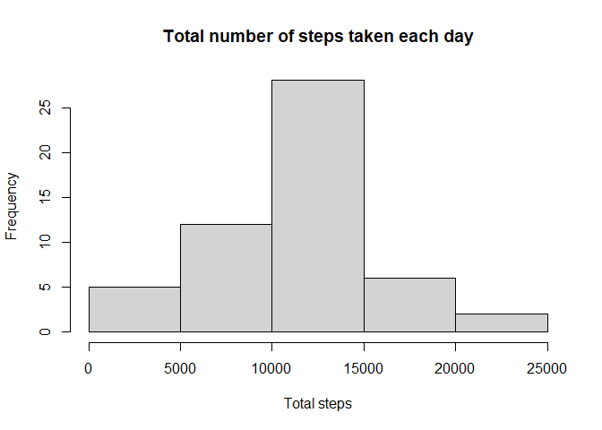
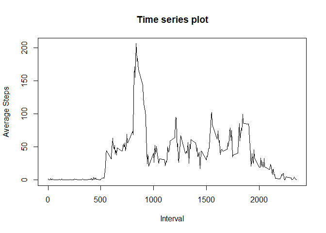
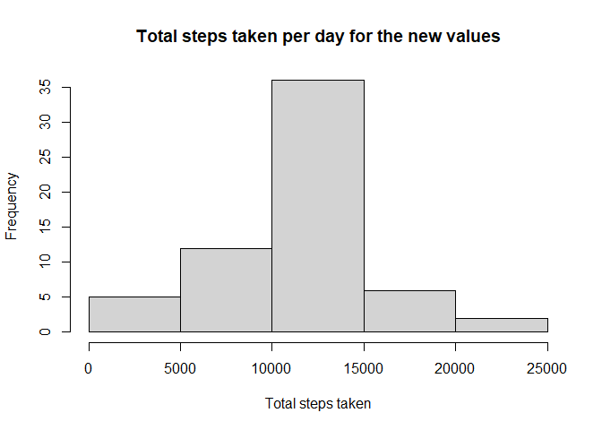
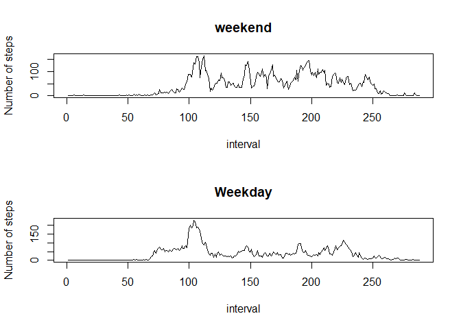

## Loading and preprocessing the data

```r
        filename <- "courser5.zip"
        if(!file.exists("filename")){
                fileurl <- "https://d396qusza40orc.cloudfront.net/repdata%2Fdata%2Factivity.zip"
                download.file(fileurl,destfile = filename)
        }
        if(!file.exists("activity.csv")){
        unzip(filename)
        }
        activity <- read.csv("activity.csv")
        activity$date <- as.Date(activity$date)
        library(dplyr)
```

```
## 
## Attaching package: 'dplyr'
```

```
## The following objects are masked from 'package:stats':
## 
##     filter, lag
```

```
## The following objects are masked from 'package:base':
## 
##     intersect, setdiff, setequal, union
```

## What is mean total number of steps taken per day?
       Removing the NA values for calculating mean

```r
        activity_rem <- activity[!is.na(activity$steps), ]
```
       Calculate the total number of steps taken per day

```r
        total_steps <- activity_rem %>% group_by(date) %>% summarise(sum(steps), na.rm=T)
```

```
## `summarise()` ungrouping output (override with `.groups` argument)
```
       Make a histogram of the total number of steps taken each day

```r
        hist(total_steps$`sum(steps)`,xlab = "Total steps", main="Total number of steps taken each day")
```

<!-- -->
        Calculate and report the mean and median of the total number of steps taken per day

```r
        mean <- activity_rem %>% group_by(date) %>% summarise(mean(steps), na.rm=T)
```

```
## `summarise()` ungrouping output (override with `.groups` argument)
```

```r
        median <- activity_rem %>% group_by(date) %>% summarise(median(steps), na.rm=T)
```

```
## `summarise()` ungrouping output (override with `.groups` argument)
```

```r
        mean
```

```
## # A tibble: 53 x 3
##    date       `mean(steps)` na.rm
##    <date>             <dbl> <lgl>
##  1 2012-10-02         0.438 TRUE 
##  2 2012-10-03        39.4   TRUE 
##  3 2012-10-04        42.1   TRUE 
##  4 2012-10-05        46.2   TRUE 
##  5 2012-10-06        53.5   TRUE 
##  6 2012-10-07        38.2   TRUE 
##  7 2012-10-09        44.5   TRUE 
##  8 2012-10-10        34.4   TRUE 
##  9 2012-10-11        35.8   TRUE 
## 10 2012-10-12        60.4   TRUE 
## # ... with 43 more rows
```

```r
        median
```

```
## # A tibble: 53 x 3
##    date       `median(steps)` na.rm
##    <date>               <dbl> <lgl>
##  1 2012-10-02               0 TRUE 
##  2 2012-10-03               0 TRUE 
##  3 2012-10-04               0 TRUE 
##  4 2012-10-05               0 TRUE 
##  5 2012-10-06               0 TRUE 
##  6 2012-10-07               0 TRUE 
##  7 2012-10-09               0 TRUE 
##  8 2012-10-10               0 TRUE 
##  9 2012-10-11               0 TRUE 
## 10 2012-10-12               0 TRUE 
## # ... with 43 more rows
```
        
## What is the average daily activity pattern?
        Finding average steps for every time interval 

```r
average_act <- activity_rem %>% group_by(interval) %>% summarise(Average_steps= mean(steps))
```

```
## `summarise()` ungrouping output (override with `.groups` argument)
```
Making the time series plot

```r
plot(average_act$Average_steps ~ average_act$interval, type = "l",xlab="Interval",ylab="Average Steps",main="Time series plot")
```

<!-- -->
Finding max


```r
max_mat <- average_act %>% filter(average_act$Average_steps == max(average_act$Average_steps))
max_mat$interval
```

```
## [1] 835
```

## Imputing missing values

Creating a mapping matrix for all the average values for the interval

```r
mean_mat <- average_act$Average_steps
```
Getting the right values

```r
x<- c()
corval<-c()
activity_new <- activity
for(i in 1:nrow(activity_new)){
        if(is.na(activity_new$steps[i])){
                x <- activity_new$interval[i]
                corval <- average_act %>% filter(interval==x)
                activity_new$steps[i] <- corval$Average_steps
        }
}
```

Total number of steps taken each day for this new table

```r
total_steps.new <- activity_new %>% group_by(date) %>% summarise(total_steps=sum(steps))
```

```
## `summarise()` ungrouping output (override with `.groups` argument)
```

```r
hist(total_steps.new$total_steps,xlab="Total steps taken",main="Total steps taken per day for the new values")
```

<!-- -->

```r
mean.new <- activity_new %>% group_by(date) %>% summarise(mean=mean(steps))
```

```
## `summarise()` ungrouping output (override with `.groups` argument)
```

```r
median.new <- activity_new %>% group_by(date) %>% summarise(median=median(steps))
```

```
## `summarise()` ungrouping output (override with `.groups` argument)
```

```r
mean.new
```

```
## # A tibble: 61 x 2
##    date         mean
##    <date>      <dbl>
##  1 2012-10-01 37.4  
##  2 2012-10-02  0.438
##  3 2012-10-03 39.4  
##  4 2012-10-04 42.1  
##  5 2012-10-05 46.2  
##  6 2012-10-06 53.5  
##  7 2012-10-07 38.2  
##  8 2012-10-08 37.4  
##  9 2012-10-09 44.5  
## 10 2012-10-10 34.4  
## # ... with 51 more rows
```

```r
median.new
```

```
## # A tibble: 61 x 2
##    date       median
##    <date>      <dbl>
##  1 2012-10-01   34.1
##  2 2012-10-02    0  
##  3 2012-10-03    0  
##  4 2012-10-04    0  
##  5 2012-10-05    0  
##  6 2012-10-06    0  
##  7 2012-10-07    0  
##  8 2012-10-08   34.1
##  9 2012-10-09    0  
## 10 2012-10-10    0  
## # ... with 51 more rows
```

## Are there differences in activity patterns between weekdays and weekends?


```r
week <- factor(c("weekday","weekend"))
activity_new <- activity_new %>% mutate(day=weekdays(date))
activityweekend <- activity_new %>% filter(day=="Sunday"| day=="Saturday") %>% group_by(interval) %>% summarise(Average_steps=mean(steps))
```

```
## `summarise()` ungrouping output (override with `.groups` argument)
```

```r
activityweekday <- activity_new %>% filter(day!="Sunday"& day!="Saturday") %>% group_by(interval) %>% summarise(Average_steps=mean(steps))
```

```
## `summarise()` ungrouping output (override with `.groups` argument)
```

```r
par(mfrow=c(2,1))
plot(activityweekend$Average_steps,type="l",xlab = "interval" ,ylab="Number of steps",main = "weekend")
plot(activityweekday$Average_steps,type = "l",xlab = "interval" ,ylab="Number of steps",main="Weekday")
```

<!-- -->


